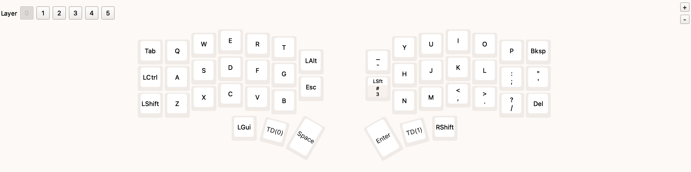
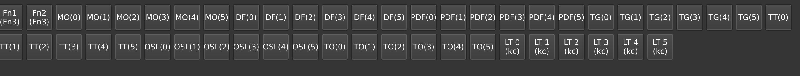
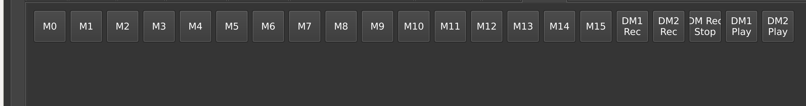
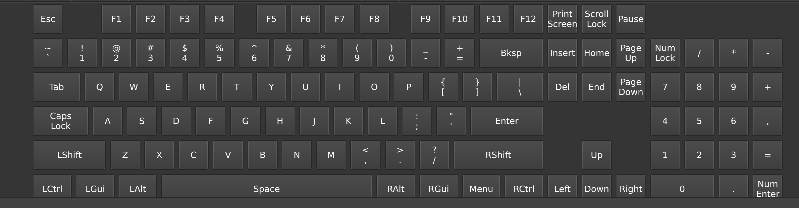
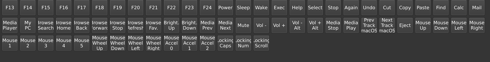

設計

# 仕様

vialで設定したキーボードの配列について、その全てのレイヤにおける設定をpdfファイルに出力する
接続技術はWEBHIDを使用し、webアプリケーションで実行できるようにしてください
キーボードのレイアウトなどの情報はvialのwebと同じような設定で表現してください
各キーボードの情報はコードではなく自然言語で行ってください
キーボードの配置は以下の画像を参考に行ってください

キーボードに表示する文字は以下の通りです

追加記述内容
以下の内容を.mdファイルとして出力してください
・このwebappの利用方法
